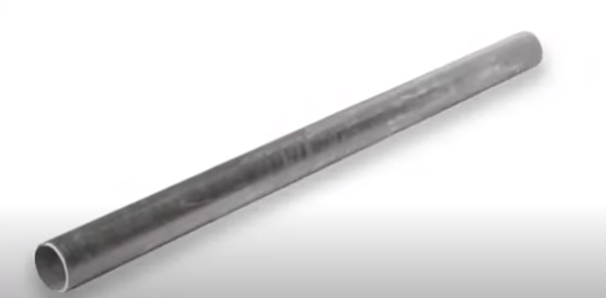

# Dale de cano de ferro Command Line Sound

    

> Dale dale mas com cano de ferro. 
> Em homenagem ao colega de trampo Vinibah.

## Compatibility

- Linux
- Windows
- Mac

## Installing
Install globally:

    npm install -g dale-de-cano-de-ferro

## Running
Run command:

    dale-de-cano-de-ferro

Or import in NodeJS script:

    import daleDeCanoDeFerro from 'daleDeCanoDeFerro';

    daleDeCanoDeFerro();
    
## Running with [npx](https://www.npmjs.com/package/npx)
Run command:

    npx daleDeCanoDeFerro

## See also

 - [Daledale](https://github.com/anabastos/daledale)
 - [Oloquinho](https://github.com/oloquinho/oloquinho)
 - [xFiles](https://github.com/BrOrlandi/xfiles/)
 - [Faustão Errou](https://github.com/BrOrlandi/faustao-errou/)
 - [Omaewa](https://github.com/BrOrlandi/omaewa/)
